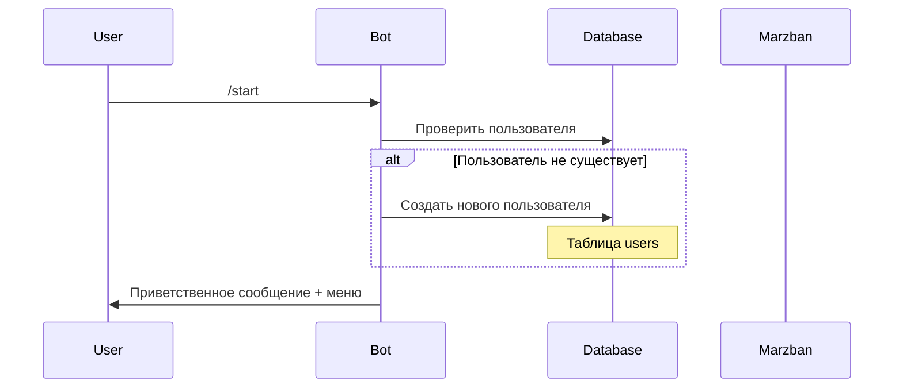
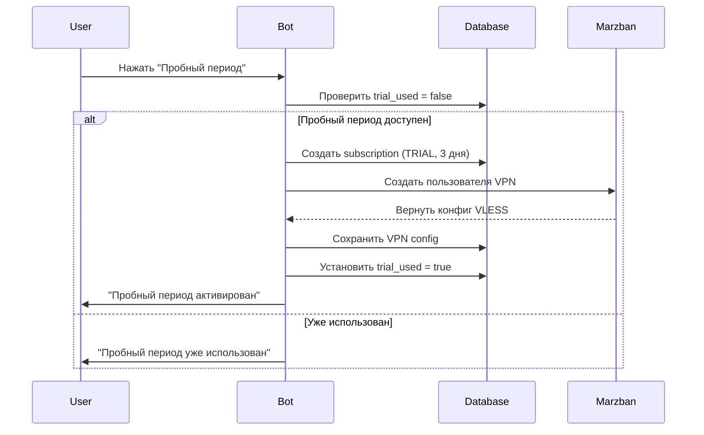
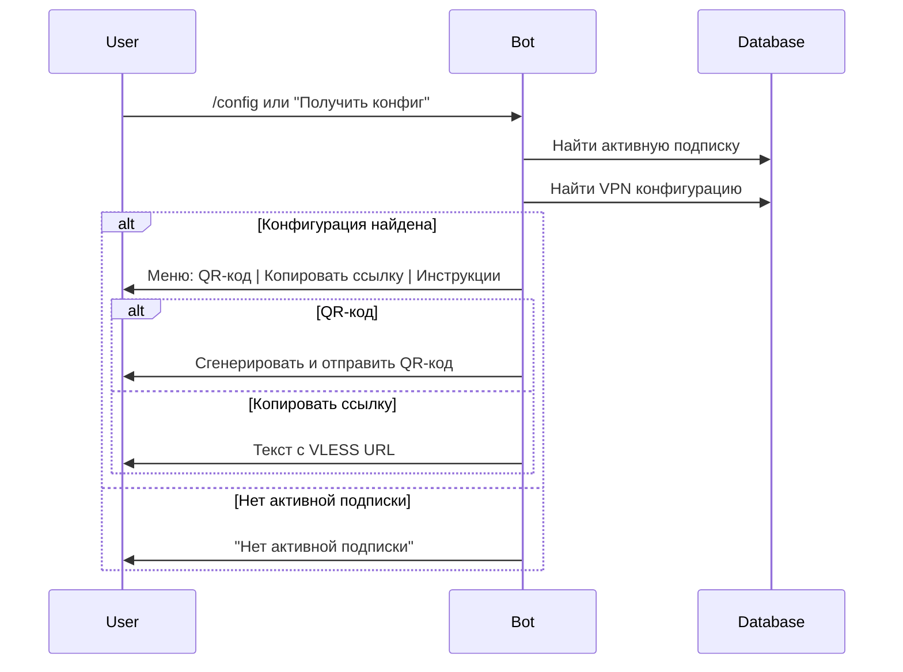
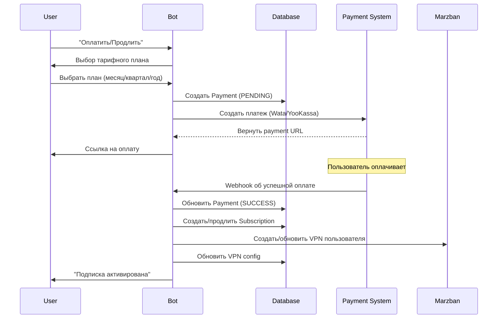
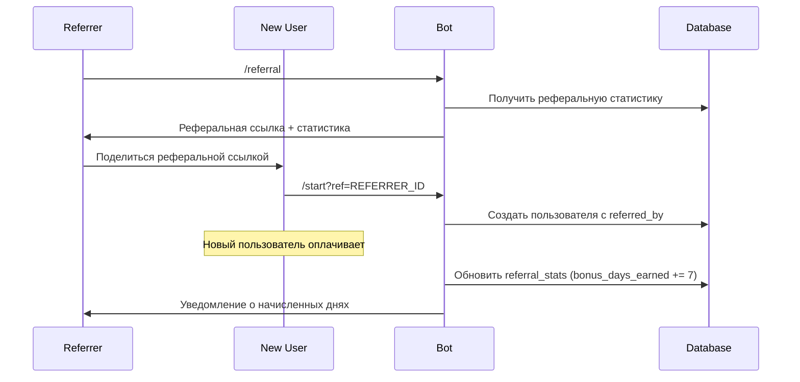

# Схема работы Telegram VPN бота

## Общая архитектура

```
┌─────────────────┐    ┌─────────────────┐    ┌─────────────────┐
│   Telegram      │    │   VPN Bot       │    │   Marzban       │
│   User          │◄──►│   System        │◄──►│   VPN Server    │
└─────────────────┘    └─────────────────┘    └─────────────────┘
                                │
                                ▼
                       ┌─────────────────┐
                       │   PostgreSQL    │
                       │   Database      │
                       └─────────────────┘
```

## Основные компоненты системы

### 1. Telegram Bot (aiogram 3.x)
- **Местоположение**: `bot/main.py`
- **Функции**: Обработка команд пользователей, управление интерфейсом
- **Handlers**: Модульная структура обработчиков команд

### 2. База данных PostgreSQL
- **Модели**: SQLAlchemy ORM для всех сущностей
- **Сессии**: Асинхронные сессии для каждого handler'а
- **Миграции**: Alembic для управления схемой БД

### 3. Marzban VPN Server
- **API клиент**: Асинхронное взаимодействие с сервером
- **Управление пользователями**: Создание, удаление, настройка VPN конфигураций
- **Протоколы**: VLESS TCP REALITY

## Детальная схема пользовательского сценария

### Сценарий 1: Регистрация нового пользователя



**Файлы**: `bot/handlers/start_handler.py`
**Таблицы БД**: `users`

### Сценарий 2: Активация пробного периода



**Файлы**: `bot/handlers/subscription_handler.py`, `services/marzban/client.py`
**Таблицы БД**: `users`, `subscriptions`, `vpn_configs`

### Сценарий 3: Получение VPN конфигурации



**Файлы**: `bot/handlers/config_handler.py`, `services/marzban/utils.py`
**Таблицы БД**: `subscriptions`, `vpn_configs`

### Сценарий 4: Оплата подписки



**Файлы**: `bot/handlers/payment_handler.py`, `services/payment/`
**Таблицы БД**: `payments`, `subscriptions`, `vpn_configs`, `pricing_plans`

### Сценарий 5: Реферальная программа



**Файлы**: `bot/handlers/referral_handler.py`
**Таблицы БД**: `users`, `referral_stats`

## Административные функции

### Схема админских команд

```mermaid
graph TD
    A[/admin] --> B[Админ-панель]
    B --> C[📊 Статистика]
    B --> D[👥 Пользователи]
    B --> E[💰 Платежи]
    B --> F[📢 Рассылка]
    B --> G[⚙️ Настройки]
    
    C --> C1[Общая статистика системы]
    D --> D1[Поиск пользователей]
    D --> D2[Блокировка/разблокировка]
    E --> E1[Последние платежи]
    F --> F1[Массовая рассылка]
    G --> G1[Системные настройки]
    
    RESET[/reset_trial] --> RESET1[Сброс пробного периода]
```

**Файлы**: `bot/handlers/admin_handler.py`
**Доступ**: По Telegram ID администратора (17499218)

## База данных - детальная схема

### Основные таблицы

#### users
```sql
- id (PK)
- telegram_id (UNIQUE)
- username, first_name, last_name
- trial_used (boolean)
- referred_by (FK -> users.id)
- created_at, updated_at
```

#### subscriptions
```sql
- id (PK)
- user_id (FK -> users.id)
- plan_id (FK -> pricing_plans.id)
- status (active, expired, trial, cancelled)
- start_date, end_date
- is_trial (boolean)
- created_at, updated_at
```

#### vpn_configs
```sql
- id (PK)
- user_id (FK -> users.id)
- marzban_user_id (UNIQUE)
- config_data (VLESS URL)
- is_active (boolean)
- created_at, updated_at
```

#### payments
```sql
- id (PK)
- user_id (FK -> users.id)
- plan_id (FK -> pricing_plans.id)
- amount, currency
- status (pending, success, failed)
- system (wata, yookassa)
- external_id, payment_url
- created_at, updated_at, completed_at
```

#### pricing_plans
```sql
- id (PK)
- name, description
- price, currency
- duration_days
- is_active (boolean)
- created_at
```

## Сервисы и интеграции

### 1. Marzban API Client (`services/marzban/`)

**Основные методы**:
- `create_user()` - Создание VPN пользователя
- `get_user()` - Получение информации о пользователе
- `delete_user()` - Удаление пользователя
- `get_user_config()` - Получение конфигурации
- `update_user()` - Обновление параметров

**Параметры создания пользователя**:
```python
CreateUserRequest(
    username=unique_username,
    expire=expire_timestamp,
    data_limit=data_limit_bytes,
    inbounds={"vless": ["VLESS TCP REALITY"]},
    excluded_inbounds={"vless": []}
)
```

### 2. Payment Services (`services/payment/`)

**Поддерживаемые системы**:
- **Wata**: Российская платежная система
- **YooKassa**: ЮKassa (Яндекс.Касса)

**Процесс оплаты**:
1. Создание платежа в БД (status=PENDING)
2. Создание платежа в внешней системе
3. Получение payment_url для пользователя
4. Обработка webhook о статусе платежа
5. Активация подписки при успешной оплате

### 3. Background Tasks (`tasks/`)

**Celery Worker** обрабатывает:
- Проверка статусов платежей
- Автоматическое продление подписок
- Отправка уведомлений
- Сбор статистики использования
- Backup данных

## Middleware и безопасность

### Middleware компоненты
- **AuthMiddleware**: Проверка авторизации (отключен в данный момент)
- **ThrottlingMiddleware**: Ограничение частоты запросов (отключен)
- **LoggingMiddleware**: Логирование действий (отключен)

### Session Management
Каждый handler создает собственную асинхронную сессию базы данных:

```python
session = async_session_maker()
try:
    # Работа с БД
    pass
finally:
    await session.close()
```

## Мониторинг и метрики

### Prometheus + Grafana
- **Prometheus**: Сбор метрик системы
- **Grafana**: Визуализация данных
- **Alerts**: Уведомления о критических событиях

### Логирование
- **Уровни**: INFO, WARNING, ERROR
- **Ротация**: Автоматическая ротация логов
- **Форматы**: JSON для структурированного логирования

## Развертывание

### Docker Compose архитектура
```yaml
services:
  - postgres (База данных)
  - redis (Кеш и очереди)
  - bot (Telegram бот)
  - api (REST API)
  - worker (Celery задачи)
  - beat (Планировщик задач)
  - flower (Monitoring Celery)
  - prometheus (Метрики)
  - grafana (Дашборды)
```

### Переменные окружения
- `BOT_TOKEN`: Токен Telegram бота
- `DATABASE_URL`: URL подключения к PostgreSQL
- `REDIS_URL`: URL подключения к Redis
- `MARZBAN_*`: Настройки подключения к Marzban
- `PAYMENT_*`: Ключи платежных систем

## Обработка ошибок и восстановление

### Стратегии обработки ошибок
1. **Database errors**: Откат транзакции, логирование
2. **Marzban API errors**: Повторные попытки, фоллбек
3. **Payment errors**: Логирование, уведомление администратора
4. **User input errors**: Валидация, понятные сообщения

### Процедуры восстановления
- **Backup**: Ежедневные backup базы данных
- **Health checks**: Автоматическая проверка сервисов
- **Restart policies**: Автоматический перезапуск упавших сервисов

## Масштабирование

### Горизонтальное масштабирование
- **Bot instances**: Несколько экземпляров бота
- **Worker nodes**: Масштабирование Celery воркеров
- **Database**: Read replicas для чтения

### Оптимизация производительности
- **Connection pooling**: Пул соединений к БД
- **Caching**: Redis для кеширования часто используемых данных
- **Async operations**: Полностью асинхронная архитектура

---

**Создано**: $(date)
**Версия**: v1.0
**Статус**: Активная разработка